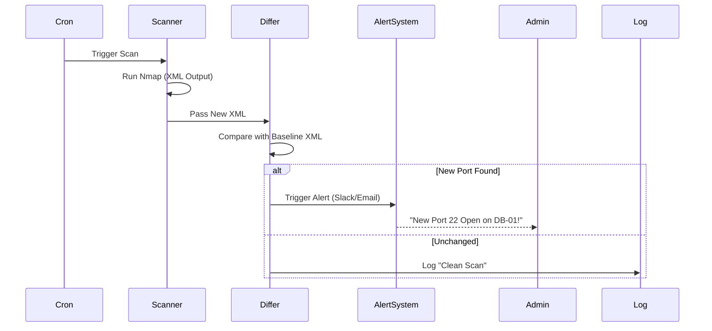

# 🔍 AutoRecon

**Continuous Security Monitoring & Vulnerability Scanner**


## 🚀 Overview

AutoRecon is a Python-based **security surveillance tool** that periodically scans your infrastructure to detect unauthorized changes. It functions as a "digital CCTV" for your network perimeter.

### 🛡️ Key Features

- ** Automated Nmap Scans:** Runs targeted scans on defined subnets.
- ** Baselining:** Compares current scan results against a known "good" state.
- ** Drift Detection:** Insantly alerts on newly opened ports or changed service versions.
- ** XML Parsing:** Custom logic to extract actionable data from scan artifacts.

## 📦 Usage

### 1. Configure Target
Edit `config.yaml` to define your target IP ranges.

### 2. Run Initial Baseline
```bash
python src/scanner.py --baseline
```

### 3. Start Monitoring
Add to crontab for hourly checks:
```bash
0 * * * * cd /opt/autorecon && python src/main.py
```

## 🏗️ Logic Flow



## 📄 License

[MIT](https://choosealicense.com/licenses/mit/)
